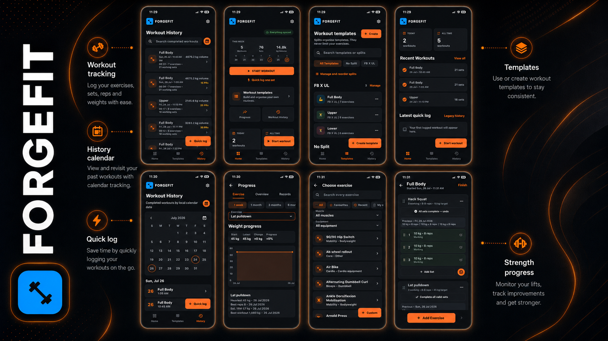
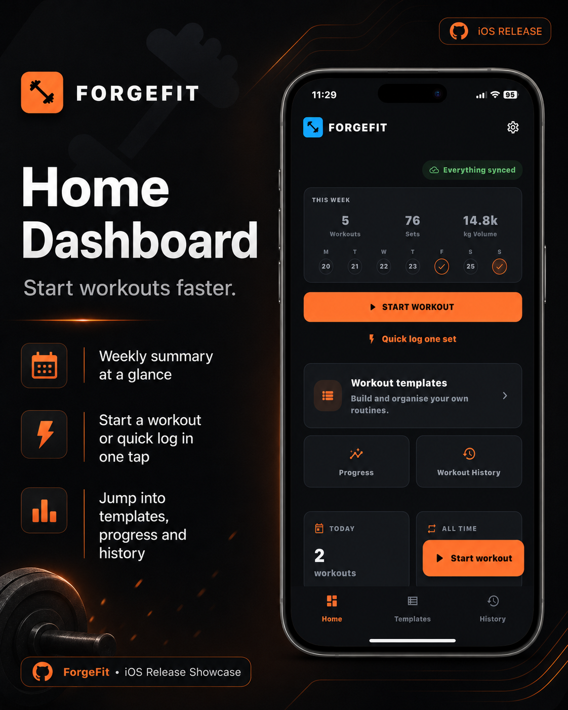
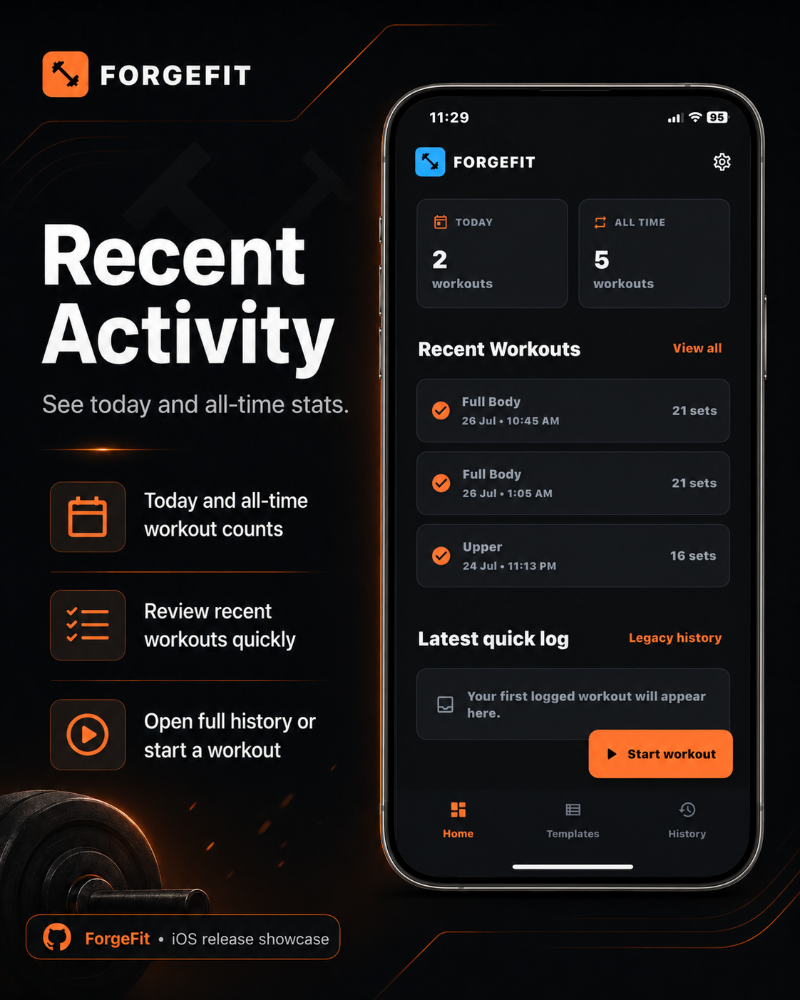
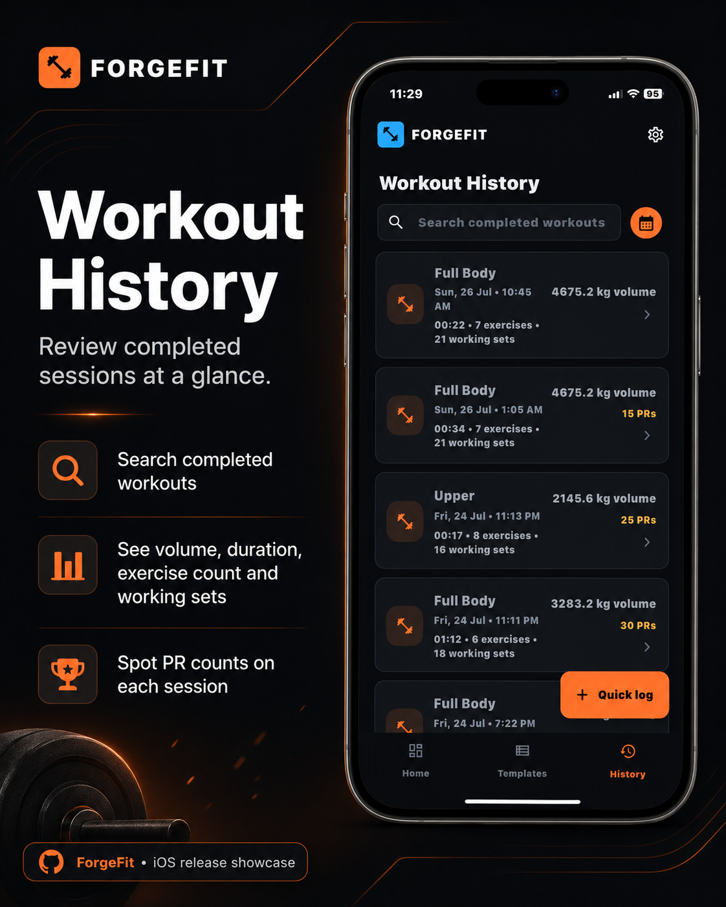
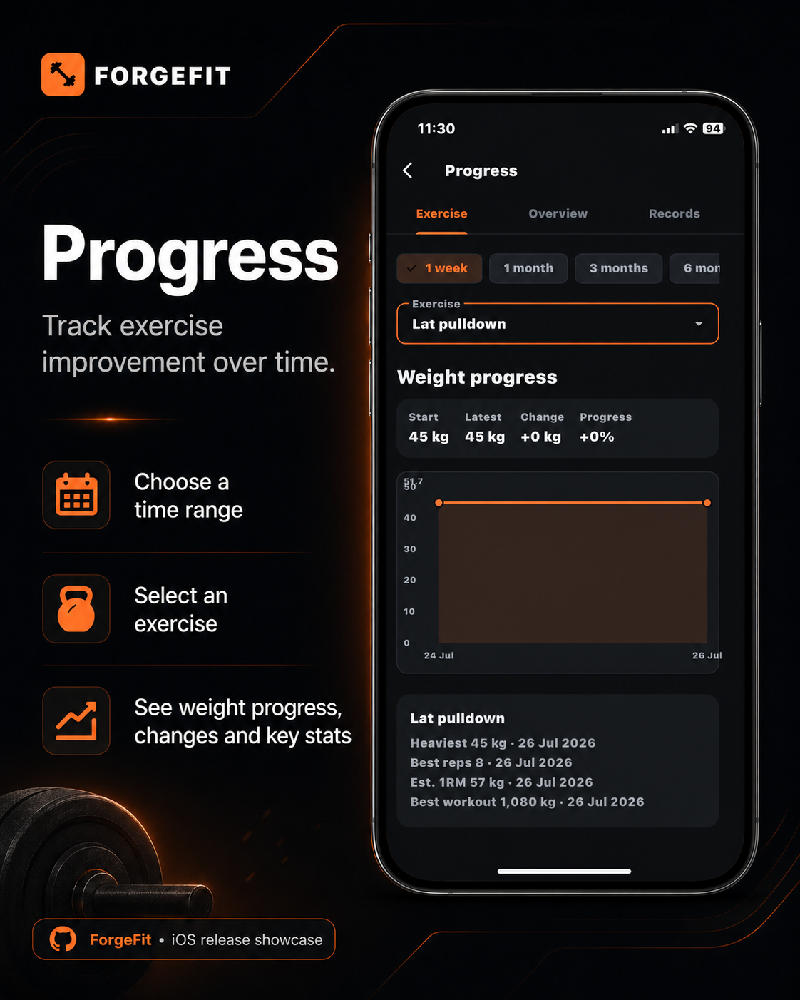
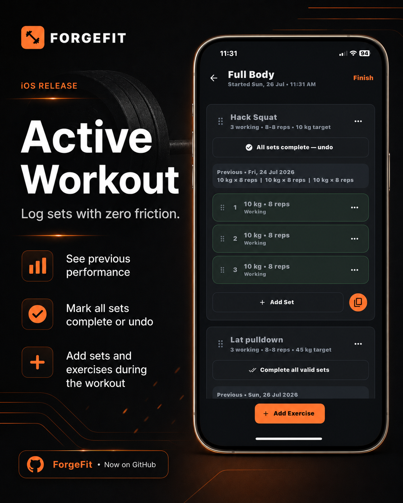
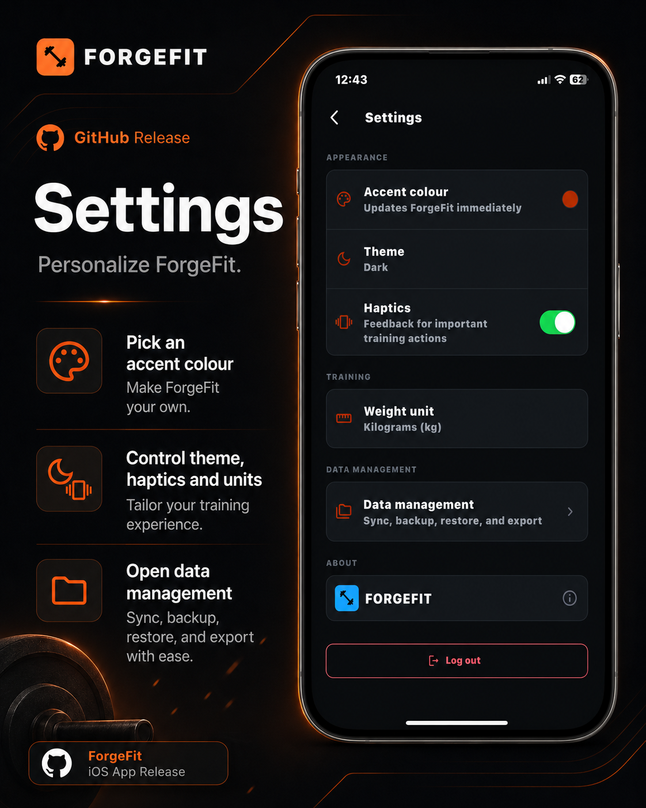

# ForgeFit — iOS Workout Tracker

ForgeFit is a local-first iOS workout tracker for fast gym logging, flexible
workout planning, progress tracking, and user-controlled data. Workouts remain
available offline and can synchronise with Supabase when a session is signed in.

## Features

- Log exercises, sets, repetitions, weight, notes, and completion state
- Create custom workout templates and splits, including templates with no split
- Add, reorder, duplicate, and edit multiple template exercises
- Search built-in and custom exercises, with favourites and recent exercises
- Review workout history, local-day calendars, personal records, and statistics
- Select an exercise and view completed-weight progress on a line chart
- Export JSON backups and workout-history CSV files, and restore a backup safely
- Use Sync Now with durable offline changes and stable UUID relationships
- Choose and persist an application accent colour and weight unit

## Technology

- Flutter and Dart
- Drift/SQLite for offline storage
- Riverpod for state management
- Supabase for authentication and cloud synchronisation
- GitHub Actions for unsigned iOS IPA builds

## Screenshots

The screenshots are stored in the `README/` folder. These links are repository-
relative, so they work from the root README on GitHub and in GitHub Desktop.

  

  
  
  

  
  
  

  
  
  

## Development and configuration

ForgeFit includes **283** read-only built-in exercises. The catalogue supports
aliases, keywords, and stable exercise identities. Progress uses
`estimated_1rm_kg = weight_kg * (1 + repetitions / 30)`, rounded to three
decimal places, with sensible validation for high-repetition sets.

Legacy Stage 1 quick logs remain readable. Remote restore uses 500-row pages
with UUID-ordered pages. Retry delays start at 2 seconds, double after each
failure, and are capped at 5 minutes.

Run only Stage 3 in Supabase SQL Editor: apply
`supabase/migrations/0003_stage_3_active_workouts.sql`. Do not paste or run
`0001` or `0002` again. Verify ownership by having Account A create a split,
then Log into Account B; Account B must not see Account A's records. A security
check must not be reported as passed until it has actually run.

Supply release configuration with `--dart-define=SUPABASE_URL=...` and
`--dart-define=SUPABASE_PUBLISHABLE_KEY=...`; `.env.*` remain ignored by Git.
Never commit credentials. The GitHub workflow creates the build configuration,
runs tests and analysis, and can Build unsigned iOS IPA. iOS Release compile
and IPA packaging remain unverified on Windows; verify them on the macOS
workflow runner.

## Platform

ForgeFit targets iOS with bundle identifier `com.marvin.forgefit`. Android
project files remain for Flutter compatibility but are not the focus of this
release.
